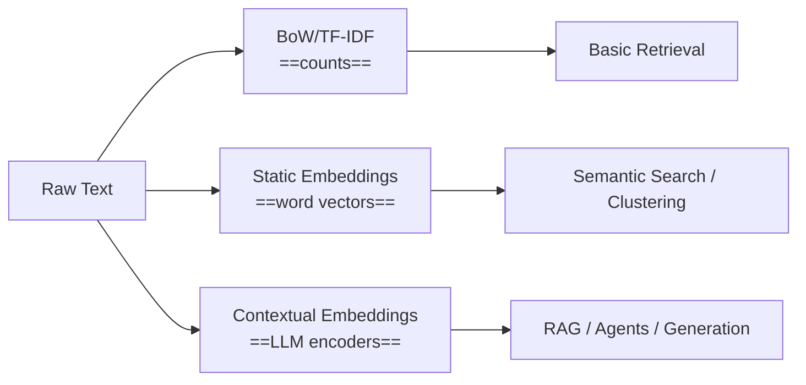

# 📘 Daily Learning Log — 2025-10-30

### Chapter/Section
> Chapter 1: An Introduction to Large Language Models (Pages 25-36)

---

## 🧾 Raw Extract
*(PDF pages 25-36 - automatically extracted)*

---

## 🧠 Copilot Notes (Generated)

# 📘 Chapter 1: An Introduction to Large Language Models (pp. 25–36) - 2025-10-30

> [!abstract] 🎯 TL;DR (90 seconds)
> - Core idea: The field moved from ==count-based representations== (bag-of-words) to ==semantic embeddings== (word2vec) to ==contextual sequence models with attention== (encoder–decoder), setting the stage for ==LLMs==.
> - Why it matters: Choosing the right ==representation== impacts your ==retrieval quality==, ==agent tools==, and ==token cost/perf== in production (LangChain/AutoGen).
> - Key takeaway: The ==context bottleneck== in early RNNs was solved by ==attention==, enabling models to use the whole input—not a single vector—to generate outputs.
> - Connects to: Transformers and scalable ==parallelization==; ==RAG== systems; ==hybrid search==; production agents with tools.
> - Watch out: Don’t use ==static embeddings== for ==polysemous words== (“bank”); and remember attention heatmaps are suggestive, not definitive explanations.

---

## 🧠 Background Concepts

> [!info] COSINE SIMILARITY (distance metric)
> What it is: Measures how similar two vectors are by the angle between them (range −1 to 1).
> 
> Why it matters: Used everywhere for ==semantic similarity== (vector DBs, rerankers, clustering).
> 
> Quick Python example:
> ```python
> import numpy as np
> 
> def cosine(u, v):
>     u, v = np.array(u), np.array(v)
>     return float(np.dot(u, v) / (np.linalg.norm(u) * np.linalg.norm(v) + 1e-9))
> 
> print(cosine([1, 0], [0.5, 0]))  # ~1.0
> print(cosine([1, 0], [0, 1]))    # ~0.0
> ```
> 
> Bridge to AutoGen/LangChain: ==Vector stores== (FAISS, Chroma) often default to ==cosine== for ==embedding search== in RAG.

---

> [!info] TF-IDF (Term Frequency–Inverse Document Frequency)
> What it is: A ==weighted bag-of-words== that down-weights common terms and up-weights rare, informative ones.
> 
> Why it matters: Strong baseline for ==keyword-centric retrieval== and ==hybrid search== with embeddings.
> 
> Quick Python example:
> ```python
> # pip install scikit-learn
> from sklearn.feature_extraction.text import TfidfVectorizer
> corpus = ["I love llamas", "Llamas love grass", "Banks manage money"]
> X = TfidfVectorizer().fit_transform(corpus)
> print(X.shape)  # (3, vocab_size)
> ```
> 
> Bridge: In LangChain, combine a ==BM25/TF-IDF retriever== with an ==embedding retriever== for robust RAG.

---

> [!info] DIMENSIONALITY REDUCTION (PCA) for visualization
> What it is: Compresses ==high-dimensional vectors== to 2D/3D for plots while roughly preserving structure.
> 
> Why it matters: Lets you visualize ==semantic neighborhoods== and debug cluster quality.
> 
> Quick Python example:
> ```python
> # pip install scikit-learn matplotlib
> import matplotlib.pyplot as plt
> from sklearn.decomposition import PCA
> import numpy as np
> X = np.random.randn(20, 50)  # 20 vectors, 50 dims
> pts = PCA(n_components=2).fit_transform(X)
> plt.scatter(pts[:,0], pts[:,1]); plt.show()
> ```
> 
> Bridge: Use PCA/UMAP to inspect ==embedding drift== after updates to your retriever or domain data.

---

> [!info] CONTEXT VECTOR BOTTLENECK
> What it is: In early seq2seq RNNs, the entire input sequence gets squashed into ==one vector== for the decoder → loses detail on long inputs.
> 
> Why it matters: Explains why ==attention== was a breakthrough—decoders could directly attend to ==all encoder states==, not just one context vector.
> 
> Bridge: Same idea shows up in production—prefer ==context-aware== retrieval/encoding over single-vector summaries for long docs.

---

> [!info] CROSS-ATTENTION HEATMAPS (interpretation)
> What it is: Visualization of ==decoder attention== over ==encoder tokens== during generation.
> 
> Why it matters: Useful to debug alignments (e.g., translations) and to build intuition for ==token-to-token influences==.
> 
> Bridge: In HF Transformers, set ==output_attentions== and aggregate heads/layers for readable heatmaps.

---

## 📖 Main Content

### 🔹 From Count-Based Vectors to Semantic Embeddings

> [!example] ⚡ Code First!
> ```python
> # Colab-ready quickstart
> # !pip install -q scikit-learn gensim matplotlib seaborn
> 
> import numpy as np
> from sklearn.feature_extraction.text import CountVectorizer, TfidfVectorizer
> from sklearn.metrics.pairwise import cosine_similarity
> from sklearn.decomposition import PCA
> import matplotlib.pyplot as plt
> import seaborn as sns
> import gensim.downloader as api
> 
> # 1) Sample corpus with polysemy: "bank" (financial vs river)
> docs = [
>     "I deposited cash in the bank",
>     "We sat on the bank of the river",
>     "Llamas love grass",
>     "I love llamas",
>     "The financial institution is a bank",
>     "The river overflowed near the bank"
> ]
> 
> # 2) Bag-of-Words and TF-IDF similarities
> bow = CountVectorizer().fit_transform(docs)
> tfidf = TfidfVectorizer().fit_transform(docs)
> 
> def top_similar(idx, X, k=3):
>     sims = cosine_similarity(X[idx], X).ravel()
>    .ranked = np.argsort(-sims)
>     return [(i, float(sims[i]), docs[i]) for i in ranked if i != idx][:k]
> 
> print("BoW top similar to [bank-finance]:", top_similar(0, bow))
> print("TF-IDF top similar to [bank-finance]:", top_similar(0, tfidf))
> print("BoW top similar to [bank-river]:", top_similar(1, bow))
> print("TF-IDF top similar to [bank-river]:", top_similar(1, tfidf))
> 
> # 3) Semantic embeddings with GloVe (static word vectors)
> #    We'll average word vectors for sentence embeddings (simple baseline).
> wv = api.load("glove-wiki-gigaword-50")  # ~66MB
> 
> def sent_embed(s):
>     toks = [t.lower() for t in s.split()]
>     vecs = [wv[t] for t in toks if t in wv]
>     return np.mean(vecs, axis=0) if vecs else np.zeros(wv.vector_size)
> 
> E = np.vstack([sent_embed(s) for s in docs])
> 
> print("Embedding top similar to [bank-finance]:", top_similar(0, E))
> print("Embedding top similar to [bank-river]:", top_similar(1, E))
> 
> # 4) Visualize with PCA (2D)
> pts = PCA(n_components=2, random_state=0).fit_transform(E)
> labels = [f"{i}" for i in range(len(docs))]
> plt.figure(figsize=(6,5))
> sns.scatterplot(x=pts[:,0], y=pts[:,1])
> for i, txt in enumerate(labels):
>     plt.annotate(txt, (pts[i,0]+0.02, pts[i,1]+0.02))
> plt.title("Sentence embeddings (avg GloVe) - PCA 2D")
> plt.show()
> ```
> 
> Tip: The numbers index docs: 0=“I deposited cash in the bank”, 1=“We sat on the bank of the river”, etc.

What’s Happening:
- We build ==BoW== and ==TF-IDF== and compare ==cosine similarities== across sentences.
- We then build ==sentence embeddings== by averaging static ==word embeddings== (GloVe).
- You’ll see TF-IDF improves keyword weighting, but ==embeddings better reflect semantics==, often separating ==bank(finance)== from ==bank(river)==.
- The ==PCA== plot shows approximate ==semantic neighborhoods==.

Theory Deep-Dive:

| Representations | What it encodes | Limitations | Strengths | Good for |
|-----------------|------------------|-------------|-----------|----------|
| ==BoW== | Token counts | Loses ==order/context==, synonymy | Fast, transparent | Keyword filtering |
| ==TF-IDF== | Weighted counts | Still context-agnostic | Emphasizes rare ==informative tokens== | BM25/hybrid search |
| ==Static embeddings== (word2vec/GloVe) | ==Semantics== via co-occurrence | ==One vector per word== (polysemy) | Good nearest neighbors | Clustering, initial RAG |
| ==Contextual embeddings== | Meaning depends on ==sentence context== | Heavier compute | Disambiguates “==bank==” | LLMs, strong RAG |

**Visual Architecture:**



> [!tip] 💡 Bridge to AutoGen/LangChain
> - Use ==TF-IDF/BM25== when your queries are short and domain terms matter (e.g., error codes).
> - Use ==contextual embeddings== for semantic queries in RAG (you already do this).
> - For safety and coverage, keep ==hybrid retrievers== (BM25 + embeddings) and compare ==recall@k== on held-out queries.

> [!warning] ⚠️ Common Mistakes
> - Averaging static word vectors loses ==word order== and ==compositional meaning==.
> - Relying only on TF-IDF yields poor synonym recall (e.g., “==bank==” vs “==financial institution==”).
> - PCA plots can be misleading—use ==UMAP== for non-linear structures when possible.

Self-Check:
- [ ] Can you explain why TF-IDF helps over raw counts?
- [ ] Did your embedding similarities separate “bank” senses better than TF-IDF?
- [ ] Try replacing GloVe with ==sentence-transformers== and compare clusters.

---

### 🔹 Seq2Seq with Attention: Seeing the Bottleneck Vanish

> [!example] ⚡ Code First! (Cross-Attention Heatmap with T5)
> ```python
> # !pip install -q transformers torch sentencepiece matplotlib seaborn
> import torch
> import seaborn as sns
> import matplotlib.pyplot as plt
> from transformers import T5ForConditionalGeneration, T5Tokenizer
> 
> device = "cuda" if torch.cuda.is_available() else "cpu"
> tok = T5Tokenizer.from_pretrained("t5-small")
> model = T5ForConditionalGeneration.from_pretrained("t5-small").to(device)
> 
> # We'll do English -> German for a crisp example
> src_text = "translate English to German: I love llamas"
> inputs = tok(src_text, return_tensors="pt").to(device)
> 
> # Generate with attentions returned
> gen_out = model.generate(
>     **inputs,
>     max_new_tokens=12,
>     num_beams=1,
>     return_dict_in_generate=True,
>     output_attentions=True
> )
> 
> # Decode output
> out_ids = gen_out.sequences[0]
> pred = tok.decode(out_ids, skip_special_tokens=True)
> print("Prediction:", pred)  # often "Ich liebe Lamas"
> 
> # Cross-attentions: list (steps) of tuples (layers) of tensors (heads, tgt_len, src_len)
> cross_atts = gen_out.cross_attentions  # length = generated steps
> # Let's visualize attention for the final token over source tokens (averaged heads/layers)
> # Aggregate across all steps to the last step (or pick any step)
> last_step = cross_atts[-1]  # tuple over layers
> # Average layers and heads
> import torch
> layer_avgs = []
> for layer_att in last_step:
>     # layer_att: (batch=1, heads, tgt_len=1, src_len)
>     layer_avgs.append(layer_att[0].mean(dim=0))  # (1, src_len) averaged across heads
> att_vec = torch.stack(layer_avgs).mean(dim=0).squeeze(0).detach().cpu().numpy()  # (src_len,)
> 
> src_tokens = tok.convert_ids_to_tokens(inputs["input_ids"][0])
> plt.figure(figsize=(8, 2.5))
> sns.heatmap(att_vec[None, :], cmap="magma", cbar=True, xticklabels=src_tokens, yticklabels=["last token"])
> plt.title("Decoder Cross-Attention over Source Tokens (last step)")
> plt.xticks(rotation=45, ha="right")
> plt.tight_layout()
> plt.show()
> ```
> 
> Notes:
> - We used ==T5== because it cleanly exposes ==cross-attention== in generation.
> - Tokens include the prompt prefix tokens; expect attention spikes near content words (“==llamas==”).

What’s Happening:
- Early seq2seq RNNs passed a single ==context vector== to the decoder (==bottleneck==). Attention changed that by letting the decoder ==attend to all encoder states==.
- In the heatmap, darker cells mean the current ==generated token== is using those ==source tokens== more.
- This is the same idea behind your mastered ==attention mechanism==, now visualized in a real model.

Theory Deep-Dive:

| Encoder–Decoder (RNN) pre-attention | Encoder–Decoder with Attention |
|-------------------------------------|--------------------------------|
| Single ==context vector== → info loss | ==Direct access== to all encoder states |
| Struggles with ==long sequences== | Better long-range alignment |
| Sequential training ==only== | Still sequential, but more ==informative gradients== |
| Harder alignments | Emergent ==token alignments== (heatmaps) |

**Visual Architecture:**

```mermaid
graph LR
    subgraph Encoder (RNN)
        E1["x1"] --> H1["h1"]
        H1 --> H2["h2"]
        H2 --> H3["h3"]
        H3 --> H4["h4"]
    end
    subgraph Decoder (RNN)
        D0["<s>"] --> D1["y1"]
        D1 --> D2["y2"]
        D2 --> D3["y3"]
    end
    H1 -. cross-attn .-> D1
    H2 -. cross-attn .-> D2
    H3 -. cross-attn .-> D3
    H4 -. cross-attn .-> D3
```

> [!tip] 💡 Bridge to AutoGen/LangChain
> - For long inputs (logs, PDFs), avoid ==single-vector summaries==; keep ==chunked contexts== and let the model “attend” across them (via RAG windows).
> - Retrieval granularity matters: smaller ==chunks== + smart ==merging== can mimic attention over the whole doc with fewer tokens.

> [!warning] ⚠️ Common Mistakes
> - Attention heatmaps are not ground-truth explanations—use them as ==diagnostics==, not proof.
> - Tokenization mismatch can skew alignments; inspect ==token strings== not raw chars.
> - Don’t assume attention alone solves all long-context issues—consider ==transformers== for true parallelism and longer windows.

Self-Check:
- [ ] Can you explain the ==context bottleneck== in one sentence?
- [ ] Change the sentence to include an ambiguous word (“==bank==”) and see how cross-attention shifts.
- [ ] Try averaging attentions across layers vs selecting a single layer—what changes?

---

### 🔹 Looking Ahead: Why Transformers Took Over

> [!example] ⚡ Quick Perf Intuition (sequential vs parallel)
> ```python
> # Illustrative only: simulate sequential vs vectorized computation
> import numpy as np, time
> 
> T, D = 2048, 1024
> X = np.random.randn(T, D)
> W = np.random.randn(D, D)
> 
> # "Sequential" (like RNN: depends on previous step)
> s = time.time()
> h = np.zeros((D,))
> for t in range(T):
>     h = np.tanh(X[t] @ W + h)  # fake recurrence
> seq_time = time.time() - s
> 
> # "Parallel" (like self-attn matmul across time)
> s = time.time()
> Y = X @ W  # one big matmul
> par_time = time.time() - s
> print(f"Sequential-like: {seq_time:.3f}s vs Parallel-like: {par_time:.3f}s")
> ```
> 
> Parallelizable operations scale much better on GPUs than strict recurrences.

Theory Deep-Dive:

| RNN + Attention | Transformer (Self-Attention) |
|-----------------|-------------------------------|
| Still ==sequential== over time | Fully ==parallelizable== over tokens |
| Hard to scale to very long sequences | Scales better; long-context variants exist |
| Good for streaming | Excellent pretraining efficiency |
| Vanishing/exploding gradients (mitigated by LSTM/GRU) | Stable training with layer norms, residuals |

> [!tip] 🚀 Production Angle
> - Prefer ==Transformer backbones== for training/inference scale.
> - Keep RNNs for ==streaming/low-latency== niches when needed, but most modern stacks (LangChain, AutoGen) assume Transformer-based LLMs.

---

## 🔧 Hands-On Challenge (10 min)

> [!question] 🎯 Goal
> See how representation choice changes retrieval quality and how attention aligns tokens in translation.

Task:
1) Extend the corpus with at least 4 more ==polysemous== examples (e.g., “==bat==” animal vs sports, “==Java==” coffee vs language).
2) Compare top-3 neighbors using ==TF-IDF==, ==avg GloVe==, and a ==sentence-transformer== (e.g., all-MiniLM-L6-v2).
3) Swap the T5 translation to a sentence with ambiguity and visualize cross-attention.

Expected Learning:
- How ==static== vs ==contextual== embeddings diverge on ambiguous terms.
- How ==attention== highlights relevant source tokens for each generated target token.

Starter Code:
```python
# !pip install -q sentence-transformers
from sentence_transformers import SentenceTransformer
from sklearn.metrics.pairwise import cosine_similarity
import numpy as np

sbert = SentenceTransformer("sentence-transformers/all-MiniLM-L6-v2")
S = sbert.encode(docs, normalize_embeddings=True)

def top_similar_mat(idx, M, k=3):
    sims = cosine_similarity(M[idx:idx+1], M).ravel()
    ranked = np.argsort(-sims)
    return [(i, float(sims[i]), docs[i]) for i in ranked if i != idx][:k]

print("SBERT top similar to [bank-finance]:", top_similar_mat(0, S))
```

---

## ✅ Concept Mastery Check

> [!success] New Concepts Covered Today
> These will be added to your mastered concepts:
> 
> - ==Context vector bottleneck==: A single-vector encoder summary limits long-sequence fidelity.
> - ==Cosine similarity==: Angle-based similarity used for embedding retrieval and clustering.
> - ==TF-IDF==: Weighted count-based representation improving over raw BoW.
> - ==Dimensionality reduction (PCA)==: Projecting high-dim vectors to 2D for visualization/debugging.
> - ==Static vs contextual embeddings==: One vector per word vs meaning changes with context.
> - ==Cross-attention heatmaps==: Visual diagnostic of source–target token alignments in encoder–decoder models.
> - ==Sequential vs parallelization constraint==: Why transformers outperform RNNs at scale.
> - ==Representation vs generation models==: Embeddings for understanding vs seq2seq for output generation.
> 
> Bonus bridges to your tooling:
> - LangChain tip: Keep ==hybrid retrievers== (BM25 + SBERT/OpenAI embeddings) and track ==recall@k== per query type.
> - AutoGen tip: For agents over long docs, prefer ==windowed RAG== with ==reranking== rather than compressing everything to a single summary.

---

> [!abstract] Quick Recap
> - We contrasted ==count-based== vs ==semantic== vs ==contextual== representations with code.
> - We visualized real ==cross-attention== to see how models align source and target tokens.
> - We built intuition for why ==attention== overcame the ==bottleneck== and paved the way to ==LLMs==.

## 📸 Extracted Images

### Figure 1 - Page 27


*Image 1 from page 27 (1439x615px)*

---

### Figure 2 - Page 28


*Image 2 from page 28 (1022x738px)*

---

### Figure 3 - Page 28


*Image 3 from page 28 (923x311px)*

---

### Figure 4 - Page 29


*Image 4 from page 29 (934x461px)*

---

### Figure 5 - Page 29


*Image 5 from page 29 (1093x530px)*

---

### Figure 6 - Page 30


*Image 6 from page 30 (1007x610px)*

---

### Figure 7 - Page 31


*Image 7 from page 31 (1233x244px)*

---

### Figure 8 - Page 31


*Image 8 from page 31 (1234x509px)*

---

### Figure 9 - Page 32


*Image 9 from page 32 (1032x591px)*

---

### Figure 10 - Page 33


*Image 10 from page 33 (1437x1002px)*

---

### Figure 11 - Page 34


*Image 11 from page 34 (982x674px)*

---

### Figure 12 - Page 34


*Image 12 from page 34 (935x483px)*

---

### Figure 13 - Page 35


*Image 13 from page 35 (979x818px)*

---

### Figure 14 - Page 36


*Image 14 from page 36 (1198x541px)*

---

### Figure 15 - Page 36


*Image 15 from page 36 (1217x689px)*

---


---

## 💭 Reflection (Your Input)
- What clicked for me today:  
- What I still find unclear:  
- How I could apply this in my projects:  
- One analogy or personal insight:

---

## ⚙️ Implementation / Experiments
*(Optional — record any notebook you ran or code idea you tested)*

```python
# Example placeholder
```

---

## ✅ Summary Sentence

"One line summary of what I learned today."

---

*Generated automatically on 2025-10-30 21:30:15*
