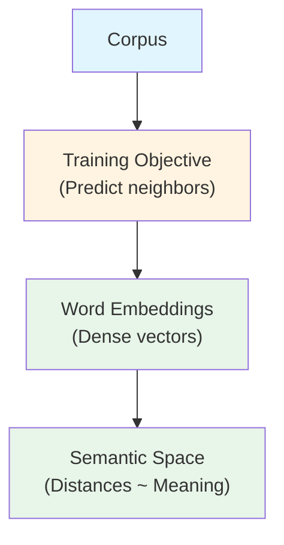
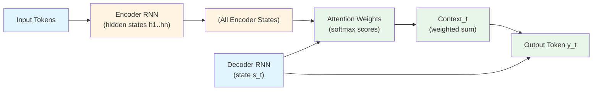
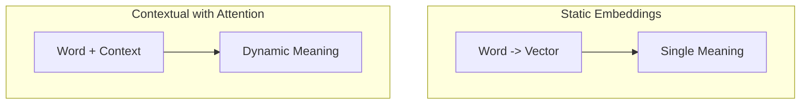

# 📘 None

**Pages**: 31-36 | **Date**: 2025-10-31

---

# 📘 Chapter 1: An Introduction to Large Language Models — 2025-10-30

> [!abstract] 🎯 TL;DR (90 seconds)
> - Core idea: Static ==embeddings== capture word meaning as vectors, but context-sensitive meaning requires sequence models (==RNN encoder-decoder==) and is dramatically improved by ==attention==.
> - Why it matters: Measuring ==semantic similarity== powers search, clustering, and RAG; attention-based seq2seq is the stepping stone to modern ==Transformers== and LLMs.
> - Key takeaway: Move from “one vector per word” (==static embeddings==) to “meaning depends on neighbors” (==contextual representations== via ==attention==).
> - Connects to: Vector search (RAG), ==tokenization==, ==cosine similarity==, ==alignment/translation==, and (soon) ==self-attention== in Transformers.
> - Watch out: Don’t assume a single ==context vector== can summarize long sentences; without ==attention==, long-range dependencies are lost.

---

## 🧠 Background Concepts

> [!info] 📚 EMBEDDING
> What it is: A fixed-length numeric vector that encodes the meaning of a token, sentence, or document.
> 
> The Problem:
> - Computers need numbers, not words. Embeddings translate text to vectors that preserve meaning better than one-hot or bag-of-words.
> - Without embeddings, similarity is “surface-level” (spelling/frequency), not “semantic” (meaning).
> - Analogy: Like a compact feature row in a database that captures the essence of an entity.
> 
> How It Works:
> - Models like ==word2vec== learn embeddings so words with similar neighbors have nearby vectors.
> - Distances (e.g., ==cosine similarity==) quantify semantic closeness.
> - Different levels: ==word embeddings==, ==sentence embeddings==, ==document embeddings==.
> 
> Minimal Illustration (5 lines):
> ```python
> import numpy as np  # arrays and math
> apple = np.array([0.9, 0.1, 0.0])   # pretend embedding
> baby  = np.array([0.1, 0.9, 0.2])   # pretend embedding
> cos = np.dot(apple, baby) / (np.linalg.norm(apple) * np.linalg.norm(baby))
> print(round(float(cos), 3))  # Expected output: a low-ish similarity, e.g., ~0.26
> ```
> Connection to your work: In LangChain/RAG, these vectors go into vector stores to perform semantic search.

> [!info] 📚 RNN
> What it is: A ==Recurrent Neural Network== processes sequences step-by-step, carrying a hidden state forward.
> 
> The Problem:
> - Language is sequential; earlier words affect later ones.
> - Simple feed-forward nets can’t “remember” previous tokens.
> 
> How It Works:
> - At each time step, consume one token’s embedding, update the hidden state.
> - Used for ==encoding== an input sentence and ==decoding== an output sentence (translation, summarization).
> 
> Minimal Illustration (conceptual fold):
> ```python
> import numpy as np
> xs = [np.array([1.,0.]), np.array([0.,1.])]  # two token embeddings
> h = np.zeros(2)  # hidden state
> for x in xs: h = np.tanh(h + x)  # toy “RNN update”
> print(h.round(3))  # Expected: some values < 1 showing memory of both inputs
> ```

> [!info] 📚 AUTOREGRESSIVE
> What it is: Generate the next token conditioned on all previously generated tokens.
> 
> The Problem:
> - Output sequences (e.g., translations) must be built one token at a time, based on earlier outputs.
> 
> How It Works:
> - y1 -> y2 -> y3 … each step consumes the tokens generated so far. Training uses teacher forcing; inference uses previous predictions.

> [!info] 📚 ATTENTION
> What it is: A mechanism that lets a model “focus” on the most relevant parts of the input when producing each output.
> 
> The Problem:
> - A single ==context vector== loses detail, especially in long sentences.
> 
> How It Works:
> - Compute ==alignment scores== between a decoder state (query) and each encoder state (keys/values), apply ==softmax== to get weights, and take a weighted sum as context.

> [!info] 📚 ENCODER / DECODER
> What it is: Encoder turns an input sequence into hidden states; decoder turns these (plus prior outputs) into the target sequence.
> 
> The Problem:
> - We need to compress input information and then expand it into a coherent output sequence.
> 
> How It Works:
> - Encoder: processes input embeddings into per-token hidden states.
> - Decoder: autoregressively generates outputs, guided by attention over encoder states.

---

## 📖 Static Embeddings and Semantic Similarity

### 🔍 The Problem & Motivation
Language needs numerical representations for computation. Early representations like ==one-hot vectors== or ==bag-of-words (BoW)== encode identity or counts but ignore meaning and order. That means “apple” and “banana” look as unrelated as “apple” and “screwdriver” if they never share exact features. We need vectors that reflect semantic relationships, not just co-occurrence counts.

Enter ==embeddings==: dense vectors that encode meaning such that similar words land near each other. If two words share similar neighbors in real text—say “king” and “queen” near “royal,” “palace,” “monarch”—their vectors should be close. Without this, tasks like semantic search, clustering, and intent detection would be brittle or impossible.

But embeddings often end up being ==static== in early methods like ==word2vec==: the word “bank” maps to a single vector regardless of whether the context is finance or rivers. That creates ambiguity whenever context changes meaning. These pages set up the move from static to context-aware representations later via attention.

### 🧠 Conceptual Foundation
The core idea: compress complex linguistic meaning into vectors whose geometry reflects relationships. Distances and angles in this space correspond to “how related” words are. Think of it like auto-generated columns in a vector table where latent properties (syntactic roles, topics, connotations) are distributed across dimensions.

An intuitive analogy: imagine tags for each word—“is-human,” “is-fruit,” “is-location,” “is-young”—but instead of explicit booleans, the model learns fuzzy, continuous activations across many such latent properties. No single dimension is “fruit,” but combinations create a signature that captures fruit-ness vs human-ness.

Why this works: text has structure—words that appear in similar contexts tend to share meaning (the distributional hypothesis). Models trained to predict neighboring words uncover these structures implicitly. Over large corpora, this pressure sculpts the embedding space so that neighbors encode meaning.

Visually, we can imagine compressing high-dimensional vectors into 2D for plotting. Points with similar semantics cluster. Distances can be measured by ==cosine similarity== (angle between vectors) or ==Euclidean distance==. Cosine is popular because it’s scale-invariant and emphasizes direction over magnitude.



### 🔬 Technical Breakdown
How do static embeddings emerge? In methods like ==skip-gram== (word2vec), a tiny neural network learns to predict surrounding context words from a target word. The weights leading to the hidden layer become the word’s embedding. Because words with similar contexts must lead to similar predictions, their embeddings converge.

Once trained, you can drop the training network and keep the lookup table: word → vector. Everything downstream (classification, clustering, semantic search) consumes these vectors. If “apple” and “pear” often share neighbors (e.g., “tree,” “fruit,” “eat”), their vectors align closely.

However, static vectors bake in an average of all senses of a word. “Bank” becomes a compromise across finance and river contexts. This is why later architectures incorporate context (RNNs, attention, Transformers), producing vectors that depend on the surrounding sentence.

There are multiple levels of embeddings. ==Word embeddings== focus on tokens; ==sentence embeddings== aggregate over words; ==document embeddings== summarize paragraphs or full texts. The choice depends on your task granularity (token-level tagging vs semantic retrieval over long docs).

### 📐 Mathematical Foundation
Let v(w) be the embedding vector for word w. Semantic similarity is often measured with cosine similarity:
cos_sim(a, b) = (v(a) · v(b)) / (||v(a)|| ||v(b)||)
This returns 1 if vectors point in the same direction (highly similar), 0 if orthogonal (unrelated), and -1 if opposite.

For skip-gram, the network maximizes the probability of context words c given target word t. With negative sampling, the objective nudges v(t) to be close to true contexts and far from sampled negatives, shaping the space.

A toy numeric example: v(apple) = [0.9, 0.1, 0.0], v(baby) = [0.1, 0.9, 0.2]. Their dot product is 0.9*0.1 + 0.1*0.9 + 0*0.2 = 0.18; norms are about 0.905 and 0.932, so cosine ≈ 0.18/(0.905*0.932) ≈ 0.213. Low similarity reflects their semantic difference.

### 💡 The "Aha!" Moment
Think of embeddings as a compressed cache of “how this word behaves across the corpus.” If two words are interchangeable in many places, their vectors will align. Geometry is meaning: direction captures semantic attributes, and closeness captures substitutability.

### 🎯 Practical Implications
- Semantic search: map queries and documents into the same space; retrieve by nearest neighbors.
- Clustering: group similar items (intents, topics) by vector proximity.
- RAG: store chunk embeddings in a vector DB; fetch the top-k chunks by similarity for better grounded generation.

| Traditional Approach | Modern LLM Approach |
|----------------------|---------------------|
| One-hot/BoW counts, no meaning | Dense ==embeddings== encoding semantics |
| Ignores order/meaning | Captures similarity via geometry |
| Poor for semantic tasks | Powers search, clustering, RAG |

> [!example] 💻 Minimal Code Illustration: Cosine Similarity
> ```python
> # CPU-only, minimal, Colab-ready
> import numpy as np  # numerical arrays and vector math
> 
> # Pretend word vectors (normally learned)
> apple = np.array([0.9, 0.1, 0.0])
> baby  = np.array([0.1, 0.9, 0.2])
> 
> # Cosine similarity = dot / (norms product)
> cos = np.dot(apple, baby) / (np.linalg.norm(apple) * np.linalg.norm(baby))
> print("cosine(apple, baby) =", round(float(cos), 3))
> # Expected: Low similarity (e.g., ~0.21 – 0.27)
> ```
> What this shows: How geometric closeness in embedding space reflects semantic similarity.

---

## 📖 From Static to Context: RNN Encoder-Decoder and Attention

### 🔍 The Problem & Motivation
Static embeddings assign one vector per word, regardless of sentence. But language is context-sensitive: “bank” could be financial or a river edge. Early seq2seq models addressed this by using ==RNNs== to process sequences and generate context-dependent outputs. The encoder summarizes the input; the decoder generates outputs autoregressively.

However, early models relied on a single ==context vector== bottleneck. For long sentences, this single summary lost information. Gradients faded across many time steps; details from earlier words got diluted. Translation quality degraded on long or complex inputs.

The breakthrough: ==attention==. Instead of cramming the whole sentence into one vector, let the decoder peek back at all encoder states and weigh them dynamically for each output token. This selective focus preserves details and dramatically improves performance.

### 🧠 Conceptual Foundation
Imagine two RNNs passing messages: the encoder reads “I love llamas,” producing a sequence of hidden states—one per input word. A naive approach squashes them into a single vector and hands it to the decoder. That’s like summarizing a paragraph into one sentence and expecting perfect recall later.

Attention says: when generating each output token, compute how relevant each encoder state is. If you’re about to produce “lama’s” (Dutch for “llamas”), the model should heavily attend to the encoder state for “llamas,” lightly to “I,” and maybe moderately to “love.” This focus shifts per output token.

Think of attention like an indexed lookup with soft weights: a query (decoder state) scans keys (encoder states), produces weights (via similarity), then aggregates values (encoder states) into a weighted sum (context vector). It’s a soft, differentiable version of “search for the most relevant parts.”



### 🔬 Technical Breakdown
- Encoder (RNN): reads input embeddings x1..xn and produces hidden states h1..hn. Unlike the single-vector bottleneck, we keep all hi so the decoder can consult them all later.
- Decoder (RNN): at time t, it has a state s_t that depends on previous outputs (autoregression). It forms a query from s_t to score each encoder hi, producing attention weights α_t,i.
- Attention: α_t = softmax(score(s_t, hi) for i=1..n). Then context c_t = Σ α_t,i * hi. The decoder uses c_t (plus s_t) to predict y_t.
- Training: teacher forcing uses ground-truth previous tokens to stabilize learning. Inference uses generated tokens, with beam search or greedy strategies.

This solves the long-sequence issue: instead of remembering everything in s_t, the model looks back at detailed, position-specific encoder states with a learned weighting.

### 📐 Mathematical Foundation
Let s_t be the decoder state at time t and h_i be encoder hidden states. Basic attention (Bahdanau) computes:
e_{t,i} = v_a^T tanh(W_s s_t + W_h h_i)
α_{t,i} = softmax_i(e_{t,i})
c_t = Σ_i α_{t,i} h_i
The context c_t is then concatenated with s_t (or combined via another layer) to predict the next token y_t.

In programming terms, think of e_{t,i} as similarity scores, α as normalized weights (softmax is like converting raw scores to a probability distribution), and c_t as a weighted average “view” over the input.

Walkthrough example: if the decoder is about to produce “lama’s,” the score e_{t,‘llamas’} > e_{t,‘I’}, e_{t,‘love’}, so α puts most mass on the “llamas” position; c_t will be dominated by h_llamas.

### 💡 The "Aha!" Moment
You don’t need to remember everything if you can look it up when needed. Attention is a differentiable lookup table over the encoder’s timeline, guided by the decoder’s current goal. This one insight removes the single-vector bottleneck and keeps long-range details accessible.

### 🎯 Practical Implications
- Better translation: align target tokens to relevant source tokens dynamically.
- Explainability: attention weights visualize alignments (which input tokens influenced a specific output).
- Foundation for Transformers: self-attention generalizes this idea, enabling massive parallelism (no recurrence) and scaling to today’s LLMs.

| Seq2Seq Without Attention | Seq2Seq With Attention |
|---------------------------|------------------------|
| Single ==context vector== bottleneck | Per-step weighted access to all ==encoder states== |
| Struggles with long inputs | Handles long-range dependencies better |
| Hard to interpret | Alignment weights offer insight |

> [!example] 💻 Minimal Code Illustration: Tiny Attention Weights
> ```python
> import numpy as np
> # Pretend encoder states for ["I","love","llamas"] (rows)
> H = np.array([[1., 0.], [0.8, 0.2], [0.1, 1.0]])  # shape (3, 2)
> s_t = np.array([0.0, 1.0])  # decoder state querying "animal-ish" dimension
> 
> # Score = dot(s_t, h_i)  (very simplified attention)
> scores = H @ s_t  # [0., 0.2, 1.0]
> # Softmax
> weights = np.exp(scores) / np.exp(scores).sum()
> context = (weights[:, None] * H).sum(axis=0)
> print("weights =", weights.round(3))   # Expected: highest on "llamas"
> print("context =", context.round(3))   # Weighted blend, close to "llamas" row
> ```
> What this shows: How a decoder state can “attend” more to the “llamas” encoder state when generating the aligned output.

---

> [!note] 🧠 Understanding the Fundamentals
> 
> 🎯 What Problem Does This Solve?
> 
> 1) The bottleneck: A single context vector can’t faithfully carry all details of long sentences; information compresses and fades.  
> 2) Static meaning issue: A single word vector ignores context, causing ambiguity (bank-finance vs bank-river).  
> 3) Sequential dependence: Generation must condition on prior outputs (==autoregression==), requiring a mechanism to integrate relevant input details at each step.  
> 
> Core Concept Breakdown:
> - ==Embeddings==: dense vectors encoding meaning via learned geometry.  
> - ==Semantic similarity==: operationalized by distances (==cosine==).  
> - ==RNN encoder==: produces per-token ==hidden states== capturing local and cumulative information.  
> - ==Decoder==: autoregressively produces output tokens.  
> - ==Attention==: scores and weights encoder states per output step to produce a targeted ==context vector==.  
> 
> How It Works (Step-by-Step Mechanism):
> - Build a vector space where neighbors reflect meaning (train word2vec or use pretrained).  
> - Feed embeddings to an encoder RNN; retain all hidden states.  
> - At each decoder step, compute alignment scores between the decoder state and each encoder state.  
> - Apply softmax to get a probability distribution over source positions.  
> - Compute a weighted sum (context) and use it to predict the next token.  
> 
> The "Aha!" Moment:
> - It’s a smart, trainable “spotlight” over the input. You don’t cram; you consult.  
> 
> Practical Implications:
> - Enables robust translation, summarization, and QA prior to Transformers.  
> - Paves the road to ==self-attention== and parallelizable ==Transformers== used by modern LLMs.  
> - In RAG, attention analogies explain why retrieving the right chunks (signal) matters for generation quality (focus).

```mermaid
graph LR
    A[Static Word2Vec] --> B[Seq2Seq RNN]
    B --> C[Seq2Seq + Attention]
    C --> D[Transformers (Self-Attention)]
```

> [!warning] ⚠️ Common Mistakes
> - Assuming each embedding dimension is a human-readable “property.” In practice, meanings are distributed.  
> - Using Euclidean distance without normalization can be misleading; cosine similarity is more robust for direction.  
> - Believing attention equals perfect interpretability: weights help, but aren’t a strict causal proof.

---

### 🔹 Visual Comparisons



| Level | Example Method | Granularity | Pros | Cons |
|------|-----------------|------------|------|------|
| Document | ==Bag-of-Words== | Whole doc | Simple, fast | No order, weak semantics |
| Word | ==word2vec== | Token | Semantic geometry | Static, ambiguous |
| Sentence | Sentence encoders | Sentence | Context-aware summary | May lose token-level detail |

---

## 🔧 Hands-On Challenge (10 min)

> [!question] 🎯 Goal
> Feel the difference between a single context vector vs attention over all encoder states.

Task:
1) Modify the tiny attention code to change s_t and see how attention weights shift.  
2) Set s_t = [1, 0] and confirm the weights now favor tokens with first-dimension signal (e.g., “I,” “love”).  
3) Explain how changing s_t simulates different decoder goals.

Starter Code:
```python
import numpy as np
H = np.array([[1., 0.], [0.8, 0.2], [0.1, 1.0]])  # encoder states
def attend(s_t):
    scores = H @ s_t
    weights = np.exp(scores) / np.exp(scores).sum()
    context = (weights[:, None] * H).sum(axis=0)
    return weights, context

for s_t in [np.array([0.,1.]), np.array([1.,0.])]:
    w, c = attend(s_t)
    print("s_t:", s_t, "| weights:", w.round(3), "| context:", c.round(3))
```

Expected Learning:
- Attention weights act like a tunable focus mechanism; the decoder state s_t steers where the model “looks.”

---

## ✅ Concept Mastery Check

> [!success] New Concepts Covered Today
> - ==Word Embedding==: Dense vector representation of a token’s meaning learned from context.
> - ==Semantic Similarity (Cosine)==: Angle-based measure to compare embeddings.
> - ==Static vs Contextual Representations==: One vector per word vs context-dependent vectors.
> - ==RNN Encoder-Decoder==: Two RNNs for sequence-to-sequence tasks.
> - ==Autoregressive Generation==: Next-token prediction conditioned on prior outputs.
> - ==Attention (Bahdanau)==: Weighted focus over encoder states to form a context vector.
> - ==Alignment Scores==: Similarity between decoder state and encoder states.
> - ==Softmax Weights==: Normalized attention distribution across inputs.
> - ==Context Vector==: Weighted sum of encoder states used at each decoding step.
> - ==Bottleneck Problem==: Single-vector summaries lose details on long sequences.
> 
> Bonus bridges to your tooling:
> - LangChain tip: Use sentence/document ==embeddings== and cosine similarity to power RAG retrieval before prompting.
> - AutoGen tip: Good retrieval (high-similarity chunks) acts like “pre-attention,” improving agent responses.

Self-Check:
- [ ] Can you explain why a single context vector fails on long sentences?
- [ ] Can you compute cosine similarity and interpret its value?
- [ ] Can you describe how attention weights are computed and used?
- [ ] Can you articulate “autoregressive” in your own words with an example?

---

---

## 📸 Page Images

> [!note] Visual Reference
> These images are from the PDF pages for visual context.

### Page 31

![[images/page_31_img_0.png]]

*1233×244px*

### Page 31

![[images/page_31_img_1.png]]

*1234×509px*

### Page 32

![[images/page_32_img_0.png]]

*1032×591px*

### Page 33

![[images/page_33_img_0.png]]

*1437×1002px*

### Page 34

![[images/page_34_img_0.png]]

*982×674px*

### Page 34

![[images/page_34_img_1.png]]

*935×483px*

### Page 35

![[images/page_35_img_0.png]]

*979×818px*

### Page 36

![[images/page_36_img_0.png]]

*1198×541px*

### Page 36

![[images/page_36_img_1.png]]

*1217×689px*


---

## 🔗 Concept Links

**Related Concepts**: #attention · #contextual-represent · #cosine-similarity · #embeddings · #learning · #llm · #ml · #rnn-encoder-decoder · #semantic-similarity · #static-embeddings · #tokenization · #transformers · #visual-comparisons

**Previous Notes**: [[2025-10-31]]

